

  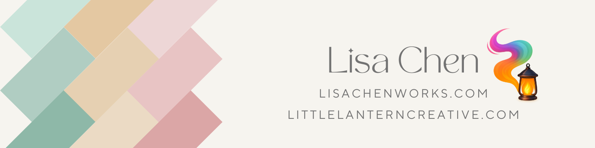

<h1 align="center">
  
</h1>

  
  
  

---
<h1 align="center">🛠️ Ctrl + Z Until It Works</h1>

  

<h2 align="center">👋 About Me</h2>

  <strong>Java-focused software engineer</strong> with experience in <strong>Python, React, and full-stack tools</strong> 
  Passionate about <strong>clean code, robust backend systems, and building software that solves real problems</strong>

 

---

  
<strong>Want the longer version?</strong>

 

I'm a full-stack software engineer with a foundation in **Java** and **Python**, currently deepening my backend skills while continuing to build clean, accessible interfaces using **React** and **Tailwind CSS**. I’ve launched open-source templates, client sites, and prototypes that balance functionality with thoughtful design.

Lately, I’ve been focusing on backend fundamentals—data structures, algorithms, and writing logic that’s easy to maintain and scale. I want the systems I build to be not only usable, but extendable by the next developer who picks them up.

Before tech, I worked in civil engineering, accounting, and restaurant management—roles that taught me to solve problems quickly, work with people across disciplines, and adapt on the fly. That real-world grounding shapes how I approach software today.

I care about building tools that are clear, helpful, and resilient. When I’m not coding, I’m either avoiding pinky toe injuries 🦶💥 or hanging out with my rescue pups 🐶.

---

### **📈 Graphs That Make Me Look Productive**

  

---

## 🌐 My Live Portfolio

### 🌐[lisachenworks.com](https://lisachenworks.com)
> A live site built with **React**, **Tailwind CSS**, and **Firebase**, showcasing my featured projects and contact links.

  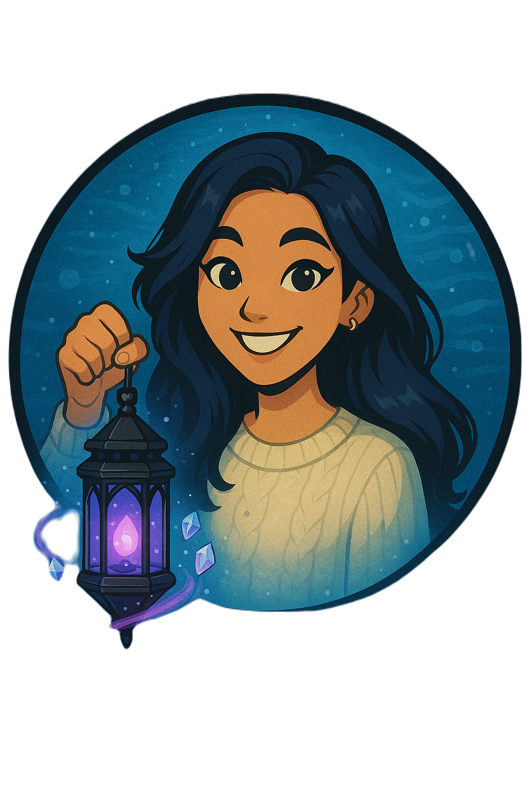

---

## 🚀 Featured Projects

### Wipe Right - Home Care Platform (DSD Cohort, 2025)
🌐 Demo: [View on Loom](https://www.loom.com/share/37681e555a074dce93130840fbd19240?sid=6a9d8af6-5146-4a3f-a914-54eb9655e714)  
🌐 Live Site (if available): [Wipe Right](https://wiperight.netlify.app/)  
🔗 GitHub Repository: [Wipe Right Backend](https://github.com/lisachen-dev/wipe_right_backend)

> Team-built platform for booking and managing home cleaning & maintenance services.  
> **Role:** Backend lead & mentor · **Stack:** FastAPI (Python), Supabase Auth/Postgres  
> **Highlights:** JWT verification & role checks · ERD/schema for 10+ tables · CRUD APIs with Pydantic & OpenAPI · Dev onboarding docs & code reviews

<table>
  <tr>
    <th colspan="3">Customer/Provider View</th>
  </tr>
  <tr>
    <td align="center">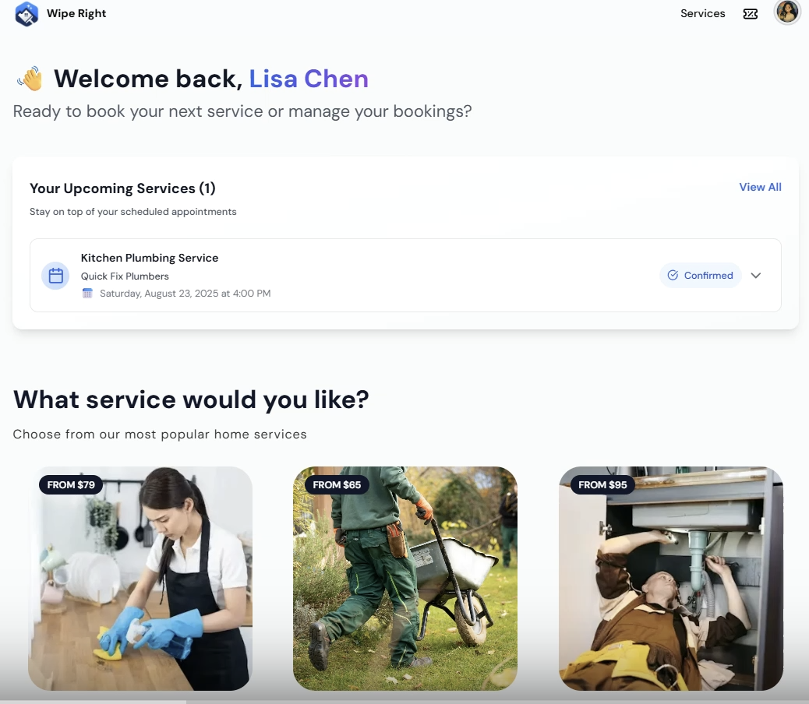</td>
    <td align="center">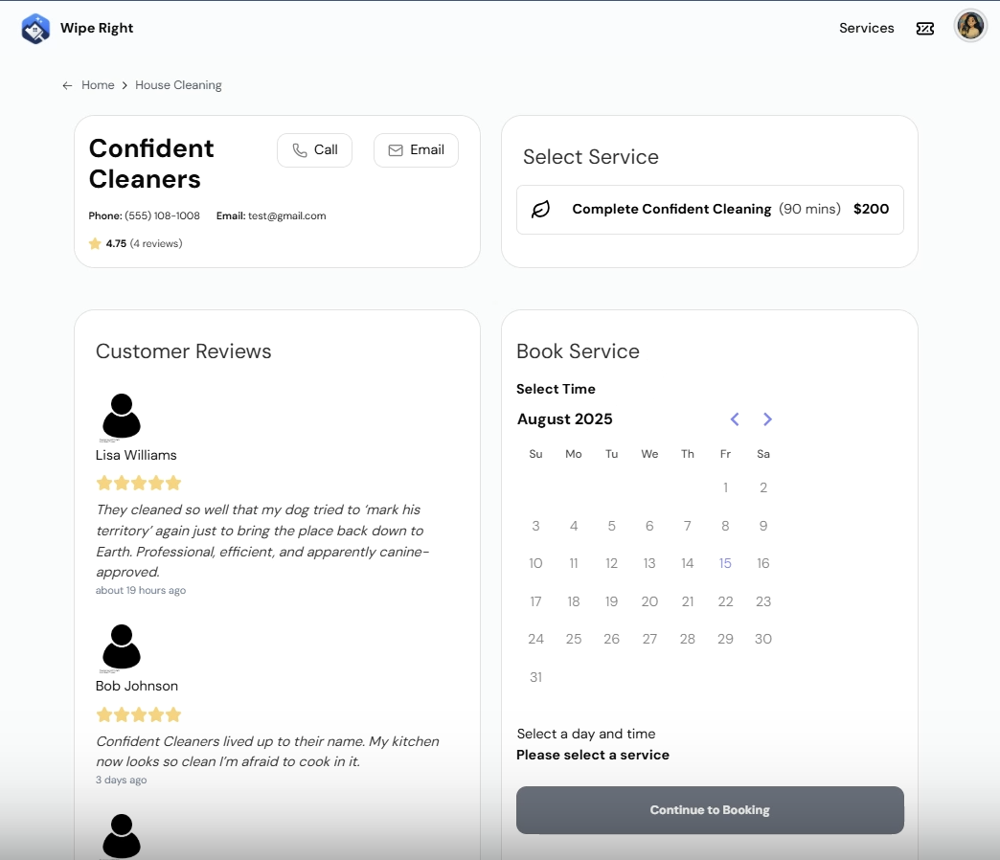</td>
    <td align="center">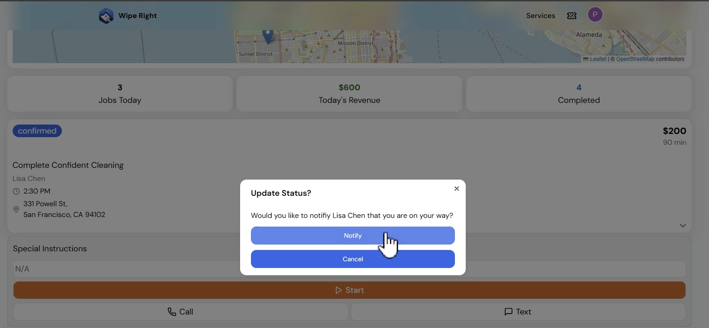</td>
  </tr>
  <tr>
    <td align="center"><em>Wipe Right Home Page</em></td>
    <td align="center"><em>Customer Booking Page with Provider Details</em></td>
    <td align="center"><em>Provider View with Booking Status and location</em></td>
  </tr>
</table>

<table>
  <tr>
    <th colspan="3">Bumi AI</th>
  </tr>
  <tr>
    <td align="center">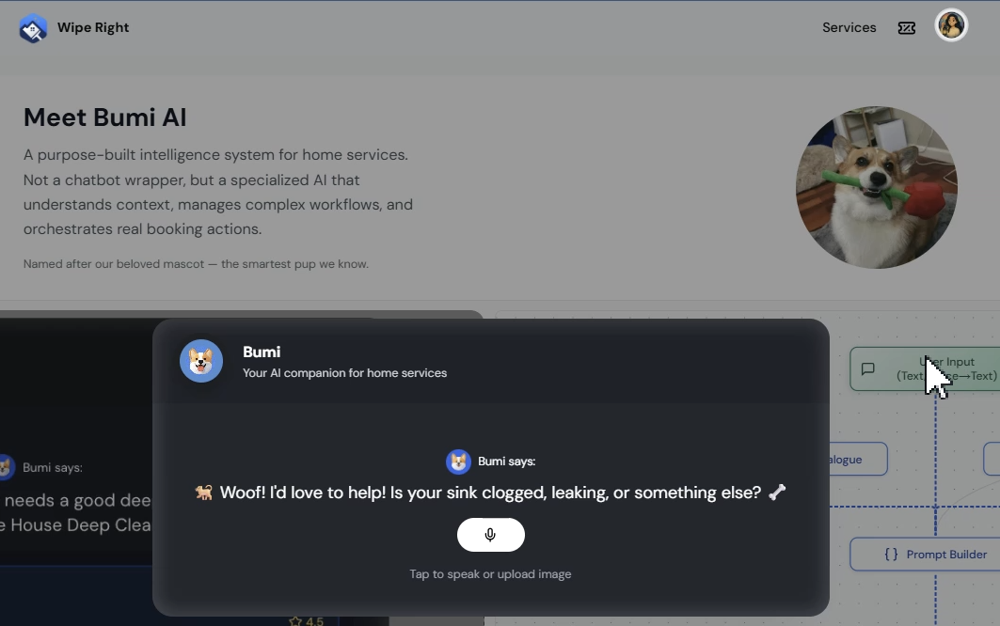</td>
    <td align="center">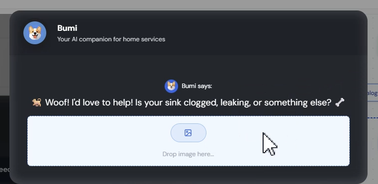</td>
    <td align="center">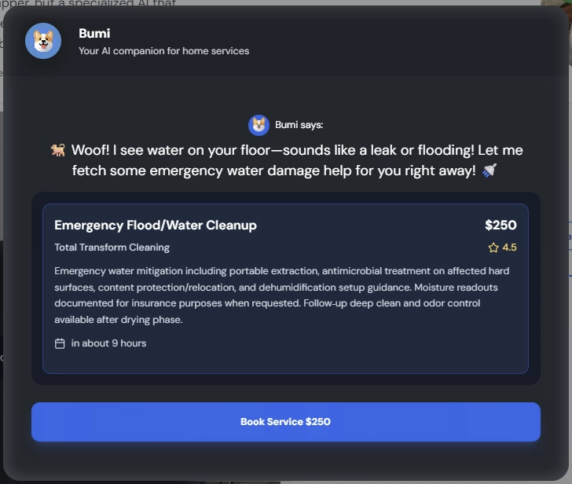</td>
  </tr>
  <tr>
    <td align="center"><em>Request for help</em></td>
    <td align="center"><em>Clarification from Bumi</em></td>
    <td align="center"><em>Bumi suggests existing service</em></td>
  </tr>
</table>

---

### Seven Hills Ultimate (Client)
🌐 Live Site: [sevenhillsultimateclub.com](http://sevenhillsultimateclub.com/)
> A content-managed club site with clear program pages, tryout info, history/roster sections.
> Focus areas: **structured navigation**, **mobile-first UX**, **CMS collections** and **SEO basics**.

    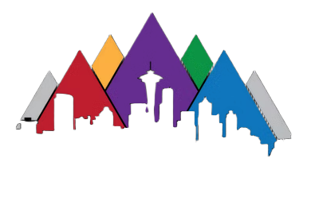

---

### 🎤 Clarkaraoke (Client)
🌐 Live Site: [clarkaraoke.com](https://clarkaraoke.com) · ✏️[Blog Post](https://tinyurl.com/clarkaraoke-from-the-flame)
> A dynamic karaoke site for a local DJ, built with **Wix CMS** and custom JavaScript enhancements.  
> Features real-time testimonials, brand-aligned styling, and light business consulting.

  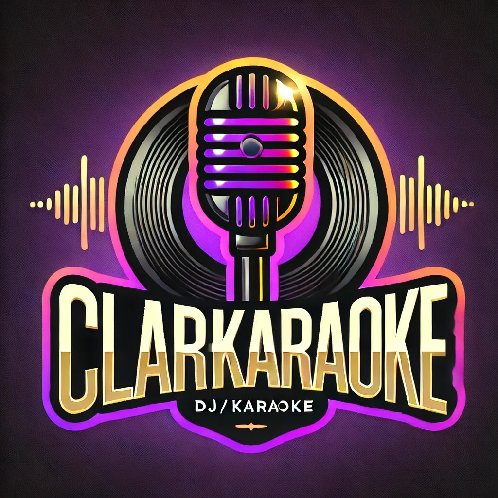

---

### Open-Source Portfolio Templates (Auric v2 + Sage v1)
🌐 Live Demo: [Auric Frame](https://auric-frame.vercel.app) · [Sage Frame](https://sage-frame.web.app/)  
🔗 GitHub Templates: [Auric Frame v2](https://github.com/lisachen-dev/auric-frame) · [Sage Frame v1](https://github.com/lisachen-dev/sage-frame-v1)  
✏️Blog Posts: [Auric Frame](https://tinyurl.com/auric-frame)

> Two iterations of my React porfolio template.
> **Auric (v2):** **React + Vite + Tailwind**, JSON-driven content, theme toggle, modular components
> **Sage (v1):** **

---

<table>
  <tr>
    <td align="center">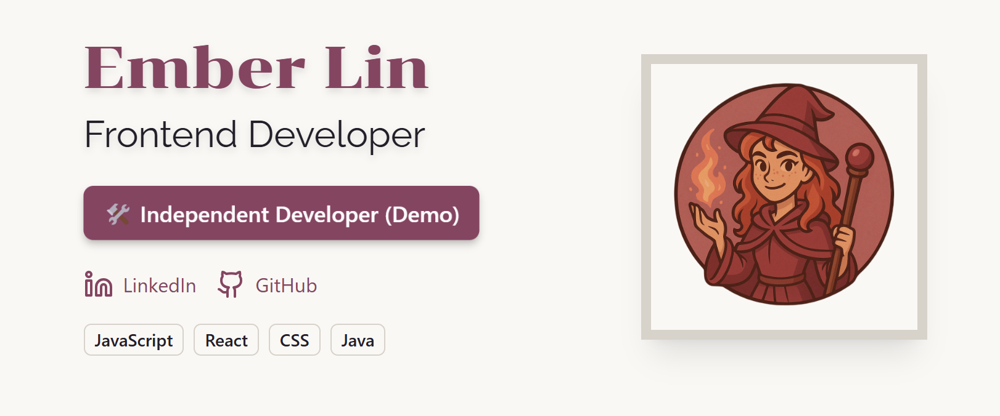</td>
    <td align="center">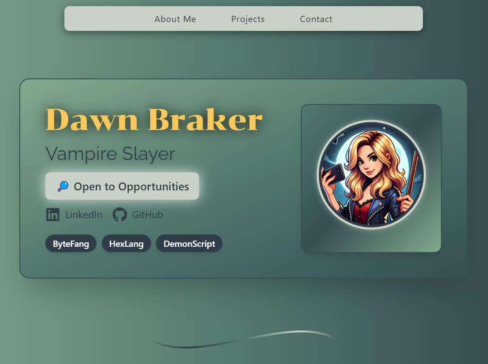</td>
  </tr>
  <tr>
    <td align="center"><em>Auric Frame (v2)</em></td>
    <td align="center"><em>Sage Frame (v1)</em></td>
  </tr>
</table>

---

## 📝 Related Blog Posts

- [Setting up the Backend for Success - Week 2 with DSD](https://www.notion.so/littlelanterncreative/Setting-up-the-Backend-for-Success-Week-2-with-DSD-23976213926580439209e95e1afa2622)
- [How I use AI to Work Smarter (Not just code faster)](https://tinyurl.com/fully-compiled)
- [How I Use AI to Think, Plan and Learn](https://tinyurl.com/planning-with-ai)
- [Mentorship Isn’t Magic — It’s Initiative](https://tinyurl.com/mentorship-from-the-flame)
- [Auric Frame v2: Clarity Over Chaos](https://tinyurl.com/auric-frame)
- [Clarkaraoke: A DJ Site That Hits All The Right Notes](https://tinyurl.com/clarkaraoke-from-the-flame)

---

---

## 🔥 From the Flame — Personal Blog

> A digital notebook of lessons, wins, and fire-forged reflections.

  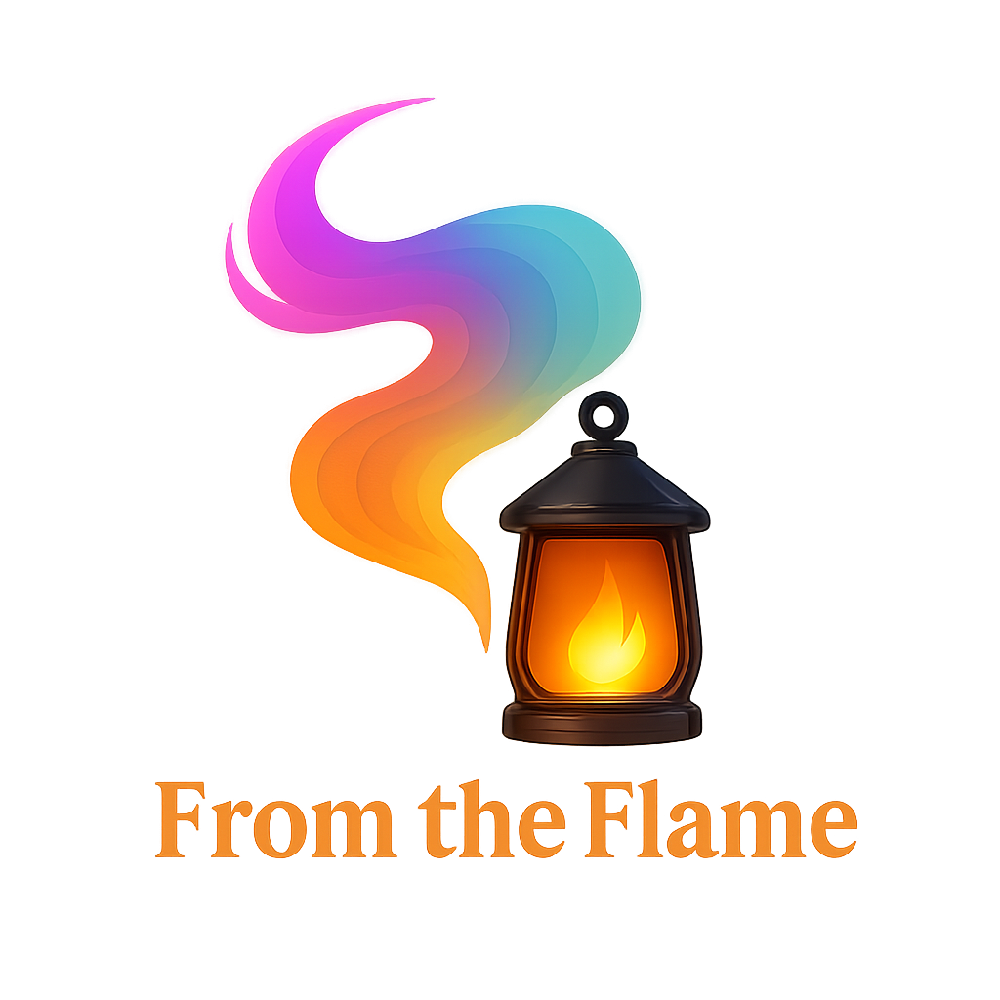

  

---

## 🔜 Upcoming Projects

---

### ☕ Form Ahead
> A full-stack event coordination tool where users submit availability and preferences.  
> Built with **Java (Spring Boot)**, **React**, and **Tailwind CSS**.

---

### 🌾 Ewesterninc
> A professional web presence with a mobile-first design and simplified ecommerce experience.  
> Built with **Wix**, **CMS Datasets**, and custom UX planning.

---

### 🐾 Dog Emergency Info Site
> A secure site for pet sitters with access to emergency contacts, routines, and health notes.  
> Built with **React**, **Tailwind CSS**, and **Firestore**.

---

<h1 align="center">🔎 Currently Exploring</h1>

  <strong>Python & Algorithms</strong> for daily LeetCode practice and technical interviews  
   <strong>React Projects</strong> using Vite, Tailwind, and modern component patterns  
   <strong>Full-stack Development</strong> with Java (Spring Boot) and React  

---

<h1 align="center">🛠 Tech Stack</h1>

  
  
  
  

<h1 align="center">🧰 Developer Toolkit</h1>

  
  
  
  
  
  
  

  Also experienced with: 
  

---
