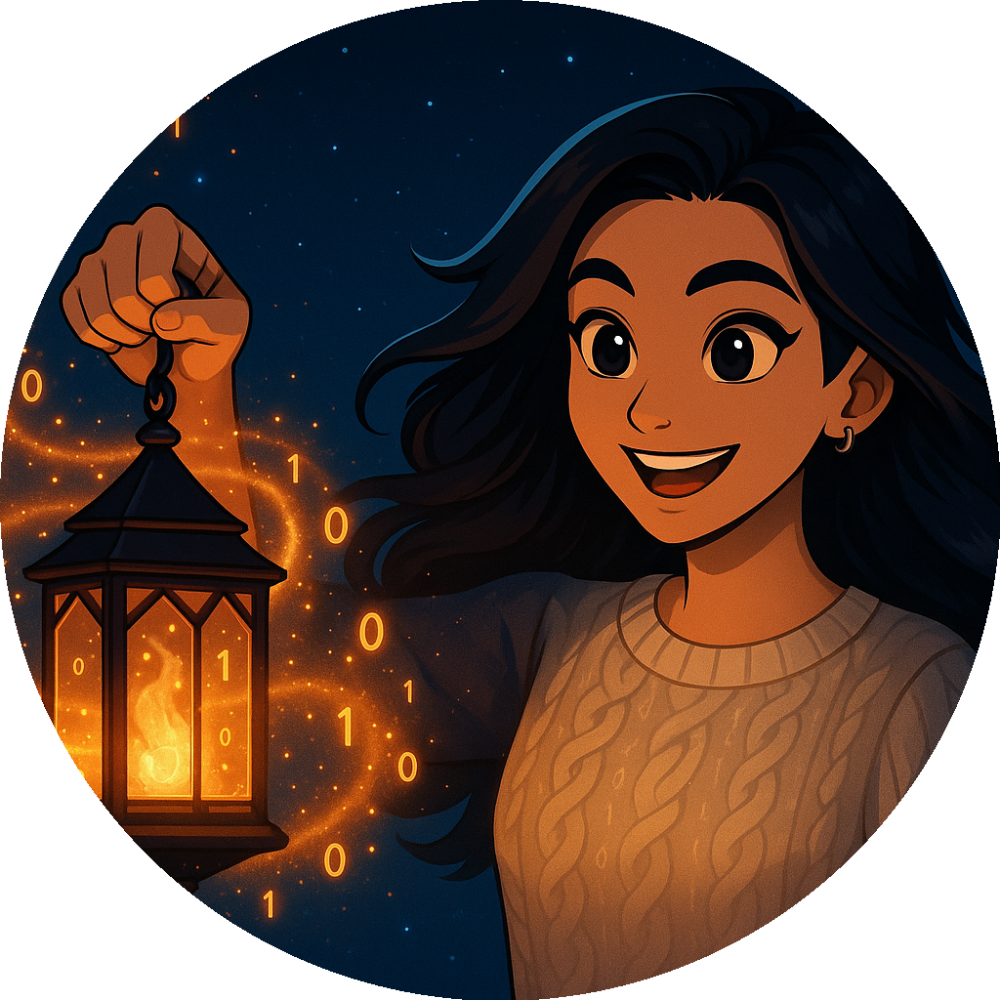

  

<h1 align="center">
  
</h1>

  
  
  

---
<h1 align="center">🛠️ Ctrl + Z Until It Works</h1>

  

<h2 align="center">👋 About Me</h2>

  <strong>Java-focused software engineer</strong> with experience in <strong>React, Python, and full-stack tools</strong> 
  Passionate about <strong>clean code, robust backend systems, and building software that solves real problems</strong>

 

---

  
<strong>Want the longer version?</strong>

 

I'm a software engineer focused on backend development with Java—currently building up my skills in Spring Boot, data structures, and API design. I’ve also explored frontend development using React and Tailwind CSS, which helped me understand full-stack workflows, even though my deeper focus is on Java.

Most of my recent projects have leaned frontend, including client sites and open-source templates. Now, I’m shifting toward backend systems that prioritize clean logic, scalability, and maintainability. My goal is to build tools that work well and are easy for other developers to extend.

Before tech, I worked in civil engineering, accounting, and restaurant management—roles that sharpened my real-world problem-solving and adaptability, both of which shape how I approach software now.

I care about writing clean, efficient code and continuously improving as a developer. When I’m not coding, I’m either avoiding pinky toe injuries 🦶💥 or hanging out with my rescue pups 🐶.

---

### **📈 Graphs That Make Me Look Productive**

  

---

## 🌐 My Live Portfolio

### 🌐[lisachenworks.com](https://lisachenworks.com)
> A live site built with **React**, **Tailwind CSS**, and **Firebase**, showcasing my featured projects and contact links.

  

---

## 🚀 Featured Projects

### 🎤 Clarkaraoke
🌐[Live Demo](https://clarkaraoke.com) · 
> A dynamic karaoke site for a local DJ, built with **Wix CMS** and custom JavaScript enhancements.  
> Features real-time testimonials, brand-aligned styling, and light business consulting.

  

---

### 🟠 Auric Frame (v2)
🌐[Live Demo](https://auric-frame.vercel.app) · 🔗[GitHub](https://github.com/lisachen-dev/auric-frame) 
> A minimalist portfolio template built with **React**, **Vite**, and **Tailwind CSS**.  
> Features JSON-driven content, dark/light theme support, and modular component structure.

  

---

### 🟢 Sage Frame (v1)
🌐[Live Demo](https://sage-frame.web.app/) · 🔗[Sage Frame v1](https://github.com/lisachen-dev/sage-frame-v1)
> The original version of my open-source portfolio template, built with **React** and **Tailwind CSS**.  
> Includes animations, theme toggling, and accessible, mobile-friendly design.

  

---

## 📝 Related Blog Posts

- 🎤 [Clarkaraoke: A DJ Site That Hits All The Right Notes](https://www.notion.so/Clarkaraoke-A-DJ-Site-That-Hits-All-The-Right-Notes-1ea762139265807a9961c67056d303b7?pvs=25)
- 🟠 [Auric Frame v2: Clarity Over Chaos](https://www.notion.so/Auric-Frame-v2-Clarity-Over-Chaos-1f07621392658018afb2e2742997b587?pvs=25)
- 🧡 [Mentorship Isn’t Magic — It’s Initiative](https://www.notion.so/Mentorship-Isn-t-Magic-It-s-Initiative-1f676213926580679e19d0c3a6ac9c3c?pvs=25)

---

---

## 🔥 From the Flame — Personal Blog

> A digital notebook of lessons, wins, and fire-forged reflections.

  

  

---

## 🔜 Upcoming Projects

### 🕺 Seductive Sounds Entertainment
> A karaoke & entertainment business site focused on bookings, packages, and testimonials.  
> Built with **Wix**, **CMS Datasets**, and custom design enhancements.

---

### ☕ HangOut Planner
> A full-stack event coordination tool where users submit availability and preferences.  
> Built with **Java (Spring Boot)**, **React**, and **Tailwind CSS**.

---

### 🐾 Dog Emergency Info Site
> A secure site for pet sitters with access to emergency contacts, routines, and health notes.  
> Built with **React**, **Tailwind CSS**, and **Firestore**.

---

### 🌾 Ewesterninc
> A professional web presence with a mobile-first design and simplified ecommerce experience.  
> Built with **Wix**, **CMS Datasets**, and custom UX planning.

---

<h1 align="center">🔎 Currently Exploring</h1>

  <strong>Java & Algorithms</strong> for technical interview prep  
   <strong>React Projects</strong> using Vite, Tailwind, and component-based architecture  
   <strong>Full-stack Development</strong> with Firebase & Firestore  

---

<h1 align="center">🛠 Tech Stack</h1>

  
  
  
  

<h1 align="center">🧰 Developer Toolkit</h1>

  
  
  
  
  
  
  

  Also experienced with: 
  

---
